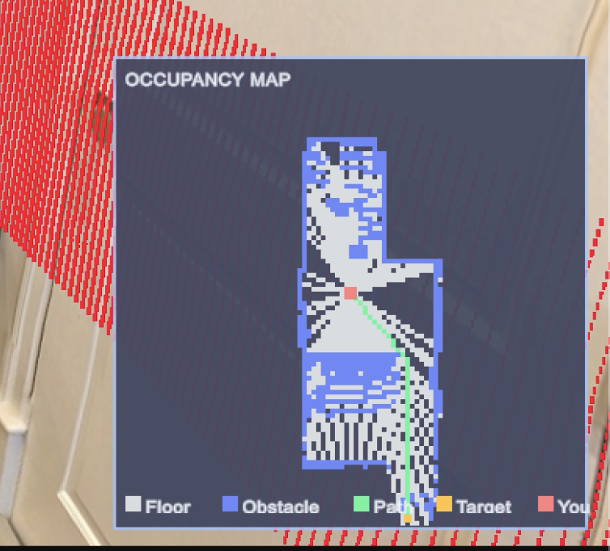
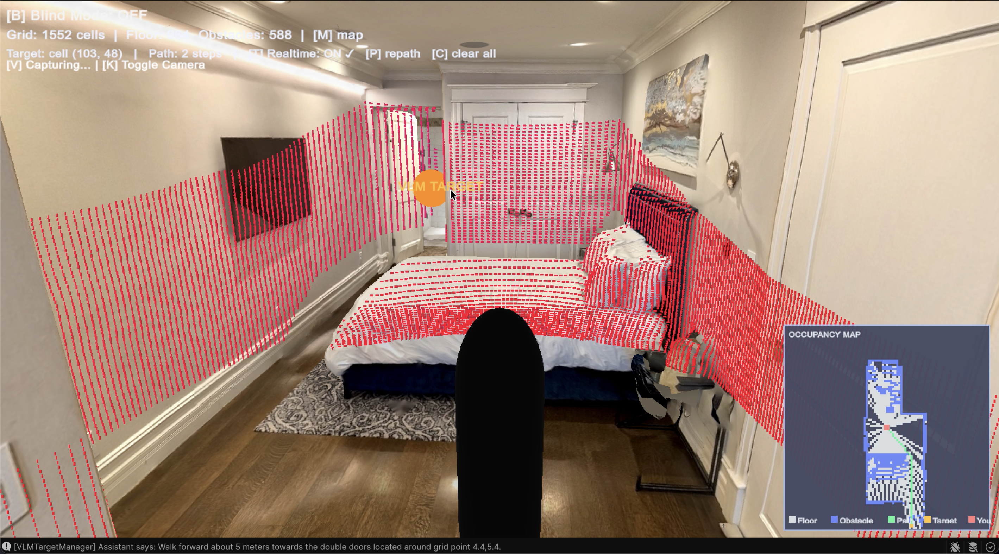
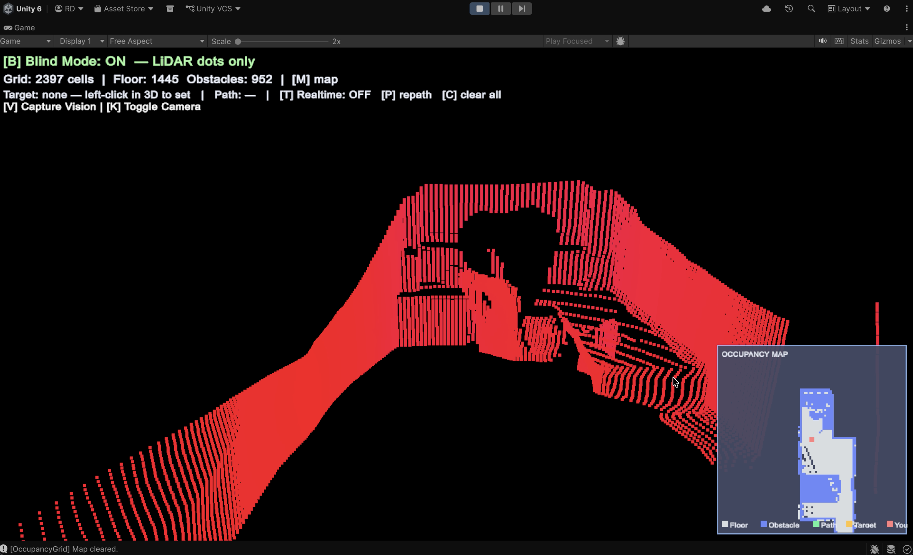

# LiDAR-Nav Sim

> [!NOTE]
> **PROOF OF CONCEPT — UNMAINTAINED**
>
> This repository is published **as-is** for the sake of open sourcing a research prototype. It has **not been cleaned up** and will **most probably not be maintained**. There are no guarantees about code quality, documentation completeness, or future updates. Use it as inspiration, a reference, or a starting point — but don't expect pull requests to be reviewed or issues to be addressed.

---

A Unity + Python hybrid navigation prototype for the visually impaired, combining real-time **LiDAR** obstacle mapping with a **Vision-Language Model (VLM)** for semantic target finding.

The core idea: LiDAR keeps you safe from immediate obstacles. VLM tells you *where* to go in natural language ("take me to the washroom door").

**License**: [MIT](LICENSE)

---

## Demo

[](https://youtu.be/8-P31cjI-rs?si=9Qk0IjZ4UotkUfsX)

*Click the thumbnail to watch the demo on YouTube (unlisted link).*

---

## Screenshots

| Minimap + Pathfinding | VLM Target Found | Blind Mode |
|---|---|---|
|  |  |  |

---

## How It Works (Quick Version)

```
User says "take me to the exit" → presses V
  → Unity snaps 4 camera views (front, back, left, right)
  → Front view sent to Python server
  → Gemini VLM identifies "exit door" on a 10×10 coordinate grid
  → Returns JSON: { grid_position: "6.2, 4.8", distance_meters: 8.5 }
  → Unity projects this into 3D world space (using the exact camera pose at capture time)
  → Orange sphere appears at the target
  → Theta* path drawn on minimap → navigate
```

Meanwhile, LiDAR continuously maps walls and obstacles so the pathfinder can route around them.

---

## Features

| Feature | Key | Description |
|---------|-----|-------------|
| LiDAR Point Cloud | — | 360° × 32-ring URP point cloud, real-time |
| VLM Target Finding | `V` | 4-view capture → Gemini → 3D orange target marker |
| Theta* Pathfinding | Left-click or auto | Any-angle smooth paths on the live LiDAR map |
| Real-time Repath | `T` | Path updates as obstacles are discovered |
| Clear Navigation | `Q` | Wipe target, path, and VLM state |
| Blind Mode | `B` | Hides geometry, shows only LiDAR dots |
| Minimap | `M` | Toggle 2D occupancy grid overlay |
| Force Repath | `P` | Manually trigger Theta* |
| Clear Map | `C` | Wipe explored LiDAR data |
| Switch Camera | `K` | Toggle MainCamera ↔ ChestCamera |

---

## Quick Start

### Prerequisites

| | Version |
|---|---|
| Unity | 6.0.x (6000.4.0f1) or later, **URP template** |
| Python | 3.8+ |
| Google Gemini API Key | Free at [aistudio.google.com](https://aistudio.google.com) |

### 1. Clone the repo

```bash
git clone https://github.com/riteshrajd/lidar-nav-sim.git
cd Haptic-Nav-Sim
```

Open the project in Unity Hub → **Add project from disk**.

### 2. Set up the Python server

```bash
cd Python-Server
python3 -m venv venv
source venv/bin/activate   # Windows: venv\Scripts\activate

pip install Pillow google-genai python-dotenv

# Create API key file
echo "GEMINI_API_KEY=your_key_here" > .env

# Start the server
python src/pipeline/pipeline_server.py
```

### 3. Configure Unity

In Unity, make sure your scene has this setup (see [docs/UNITY_SETUP.md](docs/UNITY_SETUP.md) for full details):

- `Player` (Capsule) with: `PlayerMovement`, `OccupancyGrid`, `PathFinder`, `VLMTargetManager`
- `LidarSensor` child (Empty) with: `URP_FastLidar` — **set to Layer 1 (TransparentFX)**
- `ChestCamera` child (Camera) with: `VisionCapture` — **Culling Mask must uncheck TransparentFX**
- `VLMTargetManager` → Chest Camera field → drag `ChestCamera`

### 4. Run

1. Press **Play** in Unity.
2. Walk around with `WASD`.
3. Press `V` to trigger VLM target search.
4. The server prints the VLM response; an orange sphere and path appear in Unity.
5. Press `Q` to clear and try again.

---

## Navigation Goal (The Prompt)

Change what the VLM looks for by editing `Python-Server/src/pipeline/main_pipeline.py`:

```python
PROMPT = """You are an intelligent seeing-eye assistant for a blind person.

User request: take me to the washroom, find the door.
...
```

Change `User request:` to whatever you want — the VLM is smart enough to handle complex queries like "find the closest emergency exit" or "where is the elevator?".

---

## Project Structure

```
Haptic-Nav-Sim/
├── Assets/
│   ├── OccupancyGrid.cs          ← Live 2D LiDAR mapping
│   ├── PathFinder.cs             ← Theta* pathfinding
│   ├── PlayerMovement.cs         ← Movement + Blind Mode
│   └── Scripts/
│       ├── URP_FastLidar.cs      ← LiDAR sensor (Job System)
│       ├── VisionCapture.cs      ← 4-directional image capture
│       └── VLMTargetManager.cs   ← VLM 2D→3D projection
│
├── Python-Server/
│   └── src/pipeline/
│       ├── pipeline_server.py    ← HTTP server (port 8000)
│       ├── main_pipeline.py      ← VLM orchestration + prompt
│       ├── step1_grid.py         ← Coordinate grid overlay
│       ├── step2_vision.py       ← Gemini API call
│       └── step3_parser.py       ← JSON parser
│
├── docs/
│   ├── ARCHITECTURE.md           ← Full structure + data flow
│   ├── UNITY_SETUP.md            ← Unity setup guide
│   ├── PYTHON_SETUP.md           ← Python setup guide
│   ├── HOW_IT_WORKS.md           ← Algorithm deep-dive
│   └── images/                   ← Put your screenshots here
│
├── LICENSE                       ← MIT
└── README.md                     ← This file
```

---

## Documentation

| Doc | Description |
|-----|-------------|
| [ARCHITECTURE.md](docs/ARCHITECTURE.md) | Full data flow, system design, and design decisions |
| [UNITY_SETUP.md](docs/UNITY_SETUP.md) | Unity scene setup, inspector wiring, troubleshooting |
| [PYTHON_SETUP.md](docs/PYTHON_SETUP.md) | Python server setup, swapping VLM models |
| [HOW_IT_WORKS.md](docs/HOW_IT_WORKS.md) | Deep dive into each script and algorithm |
| [vlm_navigation_plan.md](docs/vlm_navigation_plan.md) | Research roadmap and future phases |

---

## What's Working

- ✅ Real-time LiDAR (URP, Job System, 11k rays/scan)
- ✅ 2D occupancy grid with door frame correction
- ✅ Theta* any-angle pathfinding on live map
- ✅ Blind Mode (LiDAR-only view)
- ✅ VLM target finding via Gemini 2.5 Flash
- ✅ 3D target projection with Snapshot Pose (handles latency)
- ✅ VLM self-correction (AI refines previous estimates)
- ✅ Real-time path to VLM target
- ✅ Mutual target exclusion (no double markers)

## What's Not Built Yet

- ❌ Actual haptic belt hardware integration
- ❌ Autonomous walking along path
- ❌ Multi-floor / staircase navigation
- ❌ Local (offline) VLM inference
- ❌ Mobile / wearable deployment

---

## Roadmap

See [docs/vlm_navigation_plan.md](docs/vlm_navigation_plan.md) for the full research plan.

**Next steps** (if this were continued):
1. Test in diverse real-world environments (malls, stations, metros)
2. Build physical prototype (Raspberry Pi / Jetson + cameras + haptic motors)
3. Integrate local VLM for offline use
4. Real-world field testing with visually impaired participants

---

## Acknowledgements

Took some LiDAR reference code from:
- https://github.com/aisimulationresearch/Sensor-Simulation-in-Unity/blob/main/bbx_camera.unitypackage

---

## License

[MIT License](LICENSE) — Copyright (c) 2026 Ritesh Raj

Free to use, modify, and distribute. No warranties.

---

*If this project helped you or gave you ideas, a ⭐ on the repo would be appreciated — it helps others find it too.*
